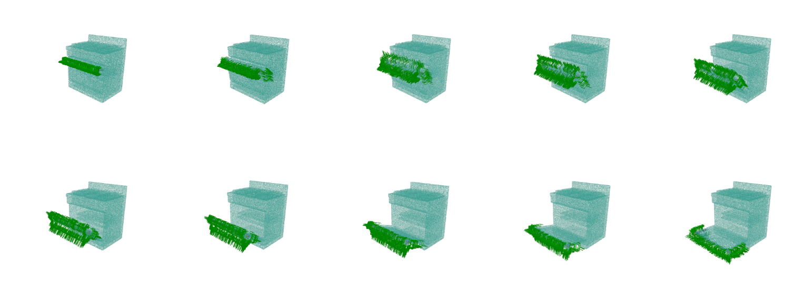
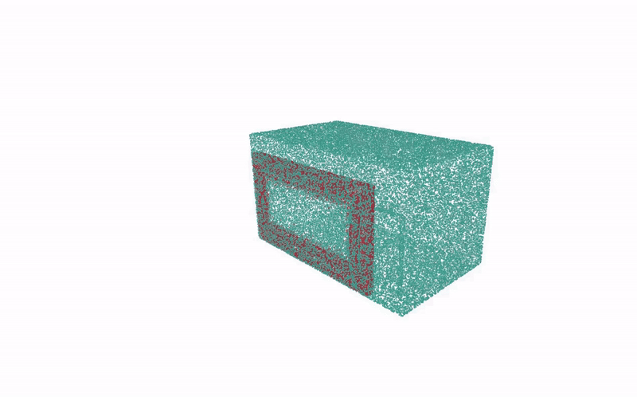

# GLArt: Grasp Labels for ARTiculated objects

Repository is part of [CenterArt](https://arxiv.org/abs/2404.14968) paper, for generating a dataset of robust object-centric 6-DoF grasp poses for articulated objects. The dataset consists of 82 articulated objects collected from the [PartNet Mobility](https://sapien.ucsd.edu/browse) dataset, spanning five different categories: Microwave, Oven, Refrigerator, Dishwasher, and Storage Furniture. Overall, 375,266 grasp labels are generated for 766 object-joint state pairs.

## Dataset Download
Download the modified urdfs and generated grasp labels:  
[urdfs](https://drive.google.com/drive/folders/1klr2KeMbU9k7b4JO4oHOqiZVy-KKENBA?usp=sharing)  
[grasps](https://drive.google.com/drive/folders/1MkgWqicKAnxJ-qMbG775N-nyzNXYMuyM?usp=sharing) 

## Installation
If you want to generate the grasp labels for new objects, first install the required libraries:

```bash
conda create --name glart_env python=3.8
conda activate glart_env
git clone git@github.com:PRBonn/manifold_python.git
cd manifold_python
git submodule update --init
make install
cd GLArt
pip install -r requirements.txt
```

## Dataset Generation
First, put the urdfs in `datasets/urdfs` and update the `configs/objects_info.json` file. Then, generate and pointclouds of articulated points:
```bash
python pointcloud_generator.py
```

Finally, generate object-centric 6-DoF grasp labels:
```bash
python grasp_generator.py
```

## Citation

```
@inproceedings{mokhtar2024centerart,
  title={CenterArt: Joint Shape Reconstruction and 6-DoF Grasp Estimation of Articulated Objects},
  author={Mokhtar, Sassan and Chisari, Eugenio and Heppert, Nick and Valada, Abhinav},
  booktitle={ICRA 2024 Workshop on 3D Visual Representations for Robot Manipulation}
}
```

## Feedback

For any feedback or inquiries, please contact sassan.mtr@gmail.com